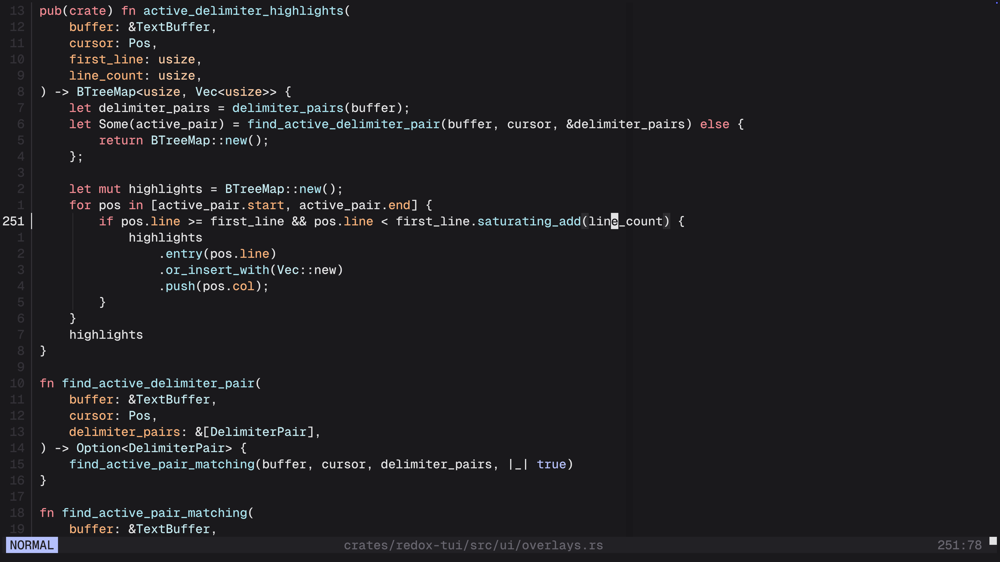

<p align="center">
    
</p>

<h1 align="center">
    A terminal-based text editor that's tasteful by default.
</h1>

<p align="center">
    <a href="https://github.com/JackDerksen/redox/actions/workflows/ci.yml"></a>
    <a href="https://deepwiki.com/JackDerksen/redox"></a>
</p>

<p align="center">
    Redox is a terminal-based, Vim-like text editor written in Rust. It was originally made for my university capstone project, but development is ongoing!
    <br><br>
    <strong>PLEASE NOTE</strong>: This editor is in no way associated with
    <a href="https://www.redox-os.org/">Redox OS</a>.
</p>

<p align="center">
    
</p>

## Project structure

Redox is a Cargo workspace with an editor core, an LSP library, and a MinUI frontend. The core crate owns editor logic that should stay UI-agnostic. The LSP crate owns protocol and process mechanisms. The TUI crate owns input mapping, app state, rendering, popups, syntax highlighting, and terminal interaction.

```text
redox/
├── Cargo.toml                  # Workspace manifest and published redox binary wrapper
├── src/main.rs                 # Thin entrypoint that calls redox-tui
└── crates/
    ├── redox-core/
    │   └── src/
    │       ├── buffer/         # Rope-backed text buffer, selections, edits, text objects
    │       ├── logic/          # Shared editor logic helpers
    │       ├── session/        # Multi-buffer session model and background loading
    │       ├── text/           # Shared text indexing and clamp helpers
    │       ├── fuzzy.rs        # Fuzzy matching and path ranking helpers
    │       ├── io.rs           # File read/write helpers
    │       ├── motion.rs       # Vim-style motion logic
    │       └── lib.rs          # Shared editor library helpers
    ├── redox-lsp/
    │   └── src/
    │       ├── transport.rs    # JSON-RPC framing and language-server processes
    │       ├── protocol.rs     # Shared LSP positions, ranges, and definition parsing
    │       ├── provider.rs     # Built-in provider catalogue and installers
    │       ├── lint.rs         # Linter processes and output parsing
    │       └── snippet.rs      # LSP snippet expansion
    └── redox-tui/
        └── src/
            ├── app/            # Main editor state and mode model
            ├── input/          # Key/event mapping, counts, operators, cursor controller
            └── ui/             # UI rendering, widgets, animations, styling
```

This split keeps buffer operations, indexing, motions, fuzzy scoring, session behaviour, and LSP mechanics testable without a terminal. The frontend can evolve the interface without pulling UI details into `redox-core` or `redox-lsp`.

**The subcrates can be found here**:

- [redox-core](https://crates.io/crates/redox-core)
- [redox-lsp](https://crates.io/crates/redox-lsp)
- [redox-tui](https://crates.io/crates/redox-tui)

## Getting Started

### Requirements

- Rust toolchain (`cargo` + `rustc`)
- A terminal that supports basic ANSI features and raw mode (and ideally full colour support). I'd **highly** recommend [Ghostty](https://ghostty.org/) for the best experience!
- Optional Go linting: golangci-lint v2.0.0 or newer. v1 is unsupported; see [Language tools](#language-tools) for setup.


### Install via CLI

The easiest way to install the editor is to just install the binary from Crates.io:
```
cargo install redox-editor
```

### Build from source

Build from source after cloning the repository:
```bash
cargo build --release -p redox-editor
```

Then install the created binary:
```
cargo install --path .
```

This installs the `redox` binary into `~/.cargo/bin` by default.

If needed, add that location to your `PATH` (example for zsh):
```bash
export PATH="$HOME/.cargo/bin:$PATH"
```


## Usage guide

### Configuration

Redox was designed from the ground-up to be pleasant without the need for configuration, but
it is highly configurable, should you choose to modify the default behaviour or appearance.

It looks for configuration at `$REDOX_CONFIG`, `$XDG_CONFIG_HOME/redox/config.toml`, or
`~/.config/redox/config.toml` (in that order). A different file can be selected with
`redox --config /path/to/config.toml`.

Configuration supports features like named themes, the complete base palette, every syntax role,
UI colour pairs, optional Nerd Font icons, background dimming, popup dimensions, colour-column
position, undo-tree history size, the leader character, and mode-specific keybindings. See the
[`config.example.toml`](config.example.toml) starter file and the complete
[`CONFIGURATION.md`](CONFIGURATION.md) reference. Unspecified values always use the built-in
defaults.

Editor-managed data (such as undo history and LSP metadata) lives separately under
`$XDG_STATE_HOME/redox/` (or `~/.local/state/redox/`), leaving the configuration directory for
`config.toml` alone. Existing legacy state is migrated automatically.

<details>
<summary>Command, navigation, editing, and search reference</summary>

### Run Redox
```bash
redox <file_path>
```

Example:
```bash
redox ./README.md
```

Open straight into the explorer for any specified directory (including `.`):
```bash
redox src
```

### Command mode

Enter command mode with `:`.

| Command | Behaviour |
| ------- | --------- |
| `:w` | Write the current buffer. Explorer buffers apply pending filesystem edits. |
| `:q` / `:quit` | Quit when all buffers are clean, or close the active surface buffer. |
| `:q!` | Force quit. |
| `:wq` | Write the current buffer, then quit when all buffers are clean. |
| `:e <path>` | Open or switch to a file buffer. |
| `:e!` / `:reload` | Reload the active file from disk. |
| `:config` | Open the active configuration file, creating its parent directory when needed. |
| `:config reload` | Reload configuration, themes, and keybindings without restarting. |
| `:colorscheme <name>` | Apply a named theme for the current session. Bare `:colorscheme` shows the active theme. |
| `:bn` / `:bnext` | Switch to the next buffer in MRU order. |
| `:bp` / `:bprev` | Switch to the previous buffer in MRU order. |
| `:ls` | Show a compact summary of open buffers. |
| `:ex` / `:explorer` | Toggle the file explorer. |
| `:about` | Toggle the about popup. |
| `:rain` | Toggle rain mode. |
| `:perf` / `:perf popup` | Toggle the performance metrics popup. |
| `:undo-tree` | Toggle the undo tree pane. |
| `:lsp list` | Open the language tools marketplace. |
| `:lsp status` | Show the active buffer's detected language tools. |

Command history is available with `Up` / `Down` or `ctrl+p` / `ctrl+n`. Move within the command line with `Left` / `Right`, and cancel with `Escape` / `ctrl+c`.

### File navigation

| Keys | Behaviour |
| ---- | --------- |
| `<space><space>` | Open the fuzzy file finder for the launch directory. |
| `<space>e` | Toggle the file explorer. |
| `<space>u` | Toggle the undo tree pane. |
| `<space>x` | Toggle the diagnostics list for the current file. |
| `<space>ca` | Show quick fixes for the diagnostic under the cursor. |
| `gd` | Go to symbol definition using the active LSP. |
| `ctrl+shift+k` | Request LSP completions in insert mode. |
| `Enter` | Open the selected explorer/finder entry. |
| `-` | Navigate to the parent directory in the explorer. |
| `ctrl+shift+p` | Open the pinboard for the current file or selected finder entry. |
| `ctrl+1` ... `ctrl+5` | Open a pinned file slot. |

Undo tree controls:

| Keys | Behaviour |
| ---- | --------- |
| `<space>u` or `:undo-tree` | Toggle the undo tree pane. |
| `j` / `k` or `Down` / `Up` | Move between undo states. |
| `h` / `l` or `Left` / `Right` | Move to the parent state / newest child state. |
| `Enter` | Restore the selected undo state. |
| `Escape` / `ctrl+c` | Close the undo tree pane. |

Finder controls:

| Keys | Behaviour |
| ---- | --------- |
| Type text | Filter files with fuzzy matching. |
| `Backspace` | Delete the previous query character. |
| `Up` / `Down` | Move through results. |
| `ctrl+p` / `ctrl+n` | Move through results. |
| `Enter` | Open the selected file. |
| `ctrl+shift+p` | Pin the selected finder entry. |
| `ctrl+1` ... `ctrl+5` | Open a pinned file slot. |
| `Escape` / `ctrl+c` | Close the finder. |

Pinboard controls:

| Keys | Behaviour |
| ---- | --------- |
| `j` / `k` or `Down` / `Up` | Move between pin slots. |
| `ctrl+n` / `ctrl+p` | Move between pin slots. |
| `p` or `shift+Enter` | Assign the current file to the selected slot. |
| `ctrl+1` ... `ctrl+5` | Assign directly to a slot while the pinboard is open. |
| `Enter` | Open the selected pinned file. |
| `shift+j` / `shift+k` | Reorder the selected pin down/up. |
| `d` | Delete the selected pin. |
| `Escape` / `ctrl+c` | Close the pinboard. |

### Language tools

Redox can start installed language servers for supported file types and display diagnostics inline, in the status bar, and in a diagnostics popup.

Open the language tools marketplace with `:lsp list`.

Go linting requires golangci-lint v2.0.0 or newer because Redox uses the v2-only
`--output.json.path stdout` and `--output.text.path stderr` flags. Check
`golangci-lint --version` before enabling it. If it reports v1, upgrade using the
[golangci-lint installation guide](https://golangci-lint.run/docs/welcome/install/local/)
and ensure the v2 binary is first on `PATH`. Existing v1 configurations also need
the [v2 migration](https://golangci-lint.run/docs/product/migration-guide/).

Completion controls:

| Keys | Behaviour |
| ---- | --------- |
| Typing code | Request completions automatically after a short pause. |
| `ctrl+i` | Show type, signature, or documentation for the symbol under the cursor. |
| `ctrl+shift+k` | Request completions in insert mode. |
| `ctrl+n` / `ctrl+p` or `Down` / `Up` | Move through completion results. |
| `Enter` | Accept the selected completion. |
| `tab` | Jump to the next snippet placeholder. |
| `ctrl+e` | Close completions. |
| `Escape` | Leave insert mode. |

Marketplace controls:

| Keys | Behaviour |
| ---- | --------- |
| `j` / `k` or `Down` / `Up` | Move through tools. |
| `i` | Enable or install the selected tool. If the executable is already on `PATH`, Redox just enables it. |
| `u` | Disable or uninstall the selected tool when Redox knows how it was installed. |
| `Escape` / `ctrl+c` | Close the marketplace. |

Diagnostics controls:

| Keys | Behaviour |
| ---- | --------- |
| `<space>x` | Toggle the diagnostics list for the current file. |
| `j` / `k` or `Down` / `Up` | Move through diagnostics. |
| `Enter` | Jump to the selected diagnostic. |
| `a` | Open quick fixes for the selected diagnostic in a lower split. |
| `Escape` / `ctrl+c` | Close the lower quick-fix split, or close the diagnostics list when no split is open. |

Code action controls:

| Keys | Behaviour |
| ---- | --------- |
| `<space>ca` | Open quick fixes for the diagnostic under the cursor. |
| `j` / `k` or `Down` / `Up` | Move through available actions. |
| `Enter` | Apply the selected quick fix. |
| `Escape` / `ctrl+c` | Close the quick-fix popup. |

Symbol info controls:

| Keys | Behaviour |
| ---- | --------- |
| `ctrl+i` | Show symbol info in normal or insert mode. |
| `ctrl+tab` | Show symbol info in insert mode. |
| `j` / `k` or `Down` / `Up` | Scroll the symbol info popup. |
| `Escape` / `ctrl+c` | Close the symbol info popup. |

Other language tool commands:

| Command / keys | Behaviour |
| -------------- | --------- |
| `:lsp status` | Show the detected language, LSP, and linter for the current file. |
| `gd` | Go to symbol definition. |
| `ctrl+i` | Show symbol info. |
| Typing code or `ctrl+shift+k` | Request completions. |

### Editing and motion

| Keys | Behaviour |
| ---- | --------- |
| `h` / `j` / `k` / `l` | Move left / down / up / right. |
| Arrow keys | Basic directional motion. |
| `w` / `b` / `e` | Move by word starts and word ends. |
| `0` / `_` / `$` | Move to line start, first non-whitespace, or line end. |
| `gg` / `G` | Jump to the start or end of the file. |
| `%` | Jump to the matching delimiter under or near the cursor. |
| `f` / `t` / `F` / `T` | Find/till a character forward or backward on the current line. |
| `i` / `I` | Insert before the cursor / at first non-whitespace. |
| `a` / `A` | Insert after the cursor / at line end. |
| `o` / `O` | Open a line below / above. |
| `J` | Join the line below onto the current line. |
| `x` | Delete the character under the cursor without touching the private register. |
| `r` | Replace the character under the cursor. |
| `dd` / `cc` / `yy` | Delete, change, or yank the current line. |
| `D` | Delete from the cursor to the end of the line. |
| `p` / `P` | Paste after/before from the private register. |
| `<space>p` | Paste from the system clipboard. |
| `u` / `ctrl+r` | Undo / redo. |
| `ctrl+d` / `ctrl+u` | Scroll down/up by one viewport. |
| `zz` | Centre the cursor line in the viewport. |
| `~` | Toggle character case, or the whole visual selection. |

### Splits

| Keys | Behaviour |
| ---- | --------- |
| `ctrl+-` | Split the active pane horizontally. |
| <code>ctrl+\</code> | Split the active pane vertically. |
| `ctrl+h` / `ctrl+j` / `ctrl+k` / `ctrl+l` | Focus the split to the left / down / up / right. |
| `ctrl+x` | Close the active split. |

### Visual modes

| Keys | Behaviour |
| ---- | --------- |
| `v` / `V` / `ctrl+v` | Enter visual, visual line, or visual block mode. |
| `y` / `d` / `c` | Yank, delete, or change the active selection. |
| `x` | Delete the selection without copying to the private register. |
| `r` | Replace the active selection. |
| `<space>y` | Yank the selection to the system clipboard. |
| `tab` / `shift+tab` | Indent / outdent the selection. |
| `J` / `K` | Move selected lines down/up. |

### Search and text objects

| Keys | Behaviour |
| ---- | --------- |
| `/` | Search in the current buffer. |
| `ctrl+n` / `ctrl+p` | Repeat the cached search forward/backward. |
| `d$`, `c$`, `y$` | Apply an operator through a motion. |
| `daw`, `ci"`, `yi(` | Apply operators to text objects. |

Notes:
- Count prefixes are supported for motions and many operators, for example `3w`, `5j`, `2G`, and `2ci]`.
- Text objects include words, big words, paragraphs, parentheses, brackets, braces, single quotes, double quotes, and backticks.
- Compound motions are functional, such as `dap`, `ci"`, `d$`, `dt,`, and `ygg`.
- Redox is intentionally opinionated, so keybindings may still move around as the editor settles.

</details>

## Roadmap

<details>
<summary>Current progress and planned work</summary>

These have roughly been categorized, and so aren't necessarily in chronological order.

- [x] Rope-backed text buffer core (`redox-core`)
- [x] TUI rendering with statusline + cursor projection
- [x] Text insertion, newline insertion, and backspace editing
- [x] Vim-style mode system (Normal / Insert / Command)
- [x] Core motion model with reusable UI-agnostic logic
- [x] Unit test coverage across core and TUI state logic
- [x] Per-buffer cursor/viewport state preservation
- [x] File open and write flows
- [x] Multi-buffer session architecture in core
- [x] Incremental loading for large files
- [x] Buffer switching commands (`:e`, `:bn`, `:bp`, `:ls`)
- [x] Intelligent dirty tracking (dirty clears when content returns to saved/original state)
- [x] Editable file explorer/picker widget
- [x] Fuzzy file finder for project directory search
- [x] Global file pinning and pinboard popup
- [x] Style module with explicit RGB-ish theme colours
- [x] `:about` screen with version info
- [x] Relative line numbers (no standard line numbers because those are objectively worse)
- [x] Directory launch mode with `redox .`
- [x] Visual mode and visual line mode
- [x] Visual block mode
- [x] Basic session-bound undo/redo
- [x] Tree-sitter syntax highlighting for
    - [x] Rust
    - [x] Markdown
    - [x] C/C++
    - [x] Go
    - [x] Lua
    - [x] Python
    - [x] HTML
    - [x] CSS
    - [x] JS/TS
    - [x] JSON
    - [x] TOML
    - [x] YAML
- [x] Smart indenting with Tree-sitter
- [x] Subtle colour column at col=80
- [x] Scope indicator lines and delimiter pair highlighting
- [x] Compound motions (like `daw` or `ci"`)
- [x] Basic local search (`/`, `f`, `F`)
- [x] Performance popup for frame timing
- [x] Toast/status popups for longer messages
- [x] LSP diagnostics, go-to-definition, completion, snippets, and language tool management
- [ ] LSP symbol renaming (project-wide)
- [x] LSP document formatting
- [x] LSP code actions and quick fixes
- [x] Basic git integration (diff stats)
- [x] In-editor splits
- [x] Undo-tree UI
- [x] Custom configuration support
- [x] More extendable leader key system with "whichkey" functionality
- [ ] Grep-based finder for searching text patterns across files
- [ ] A dashboard screen with similar functionality to nvim dashboards
- [ ] More persistent project/session state
- [ ] Broader fuzzy finder indexing and async refresh for very large repositories
- [ ] Editor command palette, making use of the fuzzy matching logic
- [ ] More Vim motions (ongoing, not marking this complete until I've caught them all!)

</details>

## License

Redox is under the terms of the MIT License.
